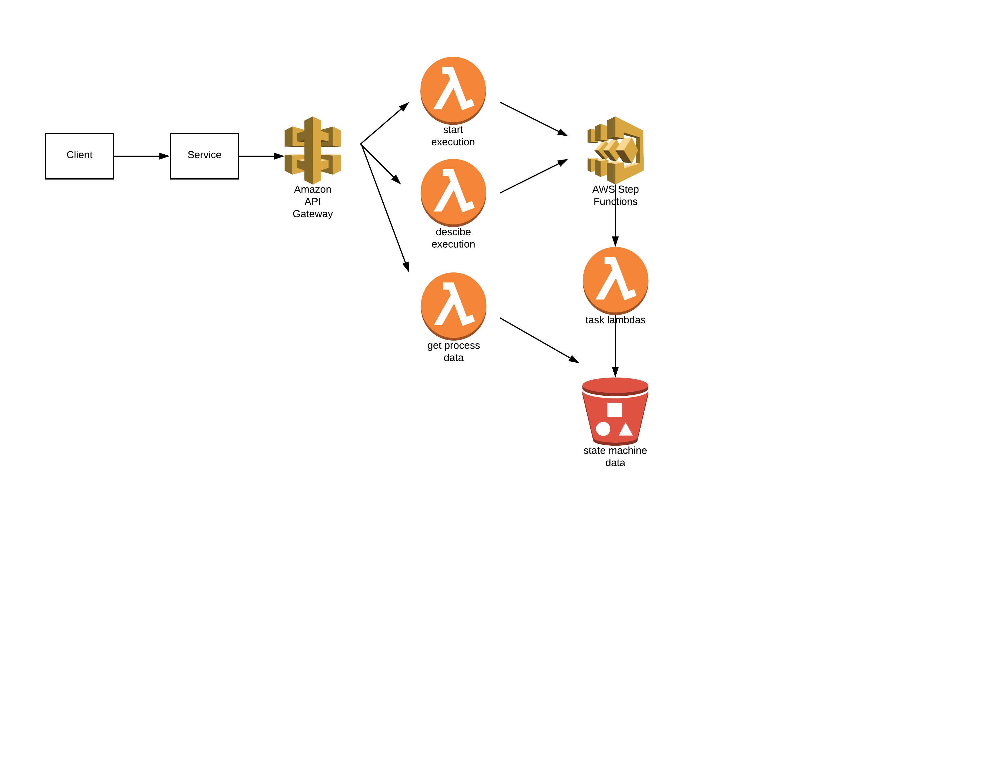

# sfs3-embedded

This project shows how to embed a step function state machine execution inside a REST service.

## Overview

The following diagram illustrates the context:


In this scenario, we want to expose a RESTful service endpoint a client can call to invoke some action and obtain the result of the action they initiated. In the service, we want to use AWS step functions to orchestrate a potentially complex sequence of calls, as well as handle retry logic, error handling, and so on.

The [Step Functions API](https://docs.aws.amazon.com/step-functions/latest/apireference/Welcome.html) provides the StartExecution action to start a new instance of the specified state machine, which returns the execution id of the started state machine. Note, however, it only indicate the state machine has been started -- it does not wait for the termination of the state machine to return a termination status.

In this scenario, it is assumed the orchestration executed by the state machine is relatively short lived - maybe half a minute to a couple minutes in duration, certainly not days, weeks, or months (which step function can accomodate).

To obtain the termination state of the step machine, the DescribeExecution action is invoked with the execution id returned by StartExecution. DescribeExecution is called repeatedly (while a sensible interval between calls) until the status in the response is no longer RUNNING.

At that point the response back to the client can be completed.

### S3 Side Car and API Facade Pattern

This project uses s3 to store all state machine data to avoid data size limitations and to have more capabilities to secure the data via bucket encryption and access policies. To make the process input data available to the process, we write the process input data to an S3 object, which will be used by the state machine for the duration of its execution. The object key is the only data related to the process that is conveyed to each step of the state machine as it executes.

To ensure the integrity of the process data, we want to grant write permission to the process data object to just the process itself. This means that that the client can't write the input data to the object prior to starting the execution as they would have the permissions needed to alter the data in the object at anytime.

To ensure the integrity of the process data, we put a facade in front of the process, allowing callers to start executions, describe the execution state, and to read the data associated with the process. We allow callers to invoke the API, but do not grant them any permissions to directly access the S3 objects.

With the API facade in place, the components of the solution look like this:



Note this pattern is agnostic to how the service instantiating the step function execution is packaged or deployed. In some cases, such as services running in a container managed by an Amazon container service, the need to use an API facade to control bucket access might not be needed as the role could be assigned to the container context.

### Dealing with S3 Consistency

Note when using s3 to hold process state data, steps that read and write process data need to account for the [S3 
consistency model](https://docs.aws.amazon.com/AmazonS3/latest/dev/Introduction.html#ConsistencyModel). In the sample code we include a read-predicate for each step to ensure the previous step's data has been read prior to proceeding. If the read predicate is not satisfied, a specific error is thrown indicating the failure, and step function error handling and retry specification is used to attempt the step again.


## Step Function and API Facade Deployment - Non VPC

To install the step function, from the `state-machine` directory:

````console
npm install
sls deploy --stage <stage name> --aws-profile <profile name>
````

The deployment will return the endpoints and API key needed to run the sample service.

## Deployment in a VPC

If desired, you can [deploy the Lambdas in a VPC you own](https://docs.aws.amazon.com/lambda/latest/dg/vpc.html). To do this, you need to know the subnets you want to place the Lambdas in, and the security groups that define their network access.

For this sample, you can install a VPC using vpc.yml.

```console
aws cloudformation create-stack --stack-name my-vpc --template-body file://vpc.yml
```

Once the VPC is installed, you will need the private subnets in the VPC, and the default security group.

To get the private subnets, look at the stack outputs via

```console
aws cloudformation describe-stacks --stack-name my-vpc
```

You can get the default security group for the vpc (using your vpc id) like this:

```console
aws ec2 describe-security-groups --filters Name=vpc-id,Values=vpc-7062b70a Name=group-name,Values=default
```

With the VPC in place and with the subnets and security group id known, edit `serverless.yml`. Uncomment the VPC section under functions stepA - stepF. You must also uncomment the eniPolicy as Lambda must have the ability to create, describe, and delete Elastic Network Interfaces to enable networking in the VPC.

Note that the Lambda placement will require access to the s3 endpoint in the region they are running in.

### Monitoring Dashboard

Use `install-dashboard.yml` to install a simple cloud watch dashboard for monitoring step function executions.

## Sample Service

The `sample-service` directory contains an implementation of the pattern discussed above. To run the sample, set the following environment variables:

* START_ENDPOINT - full url of the POST endpoint for the `start-process` resource.
* STATE_ENDPOINT - full URL of the GET endpoint for the `process-state` resource.
* APIKEY - api key associated with the API deployment

The endpoints and keys can be obtained using the `sls info` command.

With the environment variables set, to run the sample:

````console
npm install
node samplesvc.js
````