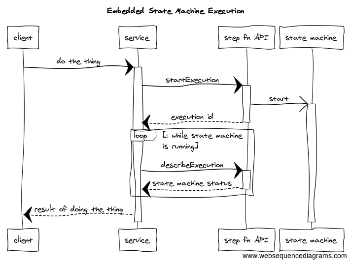

# sfs3-embedded

This project shows how to embed a step function state machine execution inside a REST service.

## Overview

The following diagram illustrates the context:



In this scenario, we want to expose a RESTful service endpoint a client can call to invoke some action and obtain the result of the action they initiated. In the service, we want to use AWS step functions to orchestrate a potentially complex sequence of calls, as well as handle retry logic, error handling, and so on.

The [Step Functions API](https://docs.aws.amazon.com/step-functions/latest/apireference/Welcome.html) provides the StartExecution action to start a new instance of the specified state machine, which returns the execution id of the started state machine. Note, however, it only indicate the state machine has been started -- it does not wait for the termination of the state machine to return a termination status.

In this scenario, it is assumed the orchestration executed by the state machine is relatively short lived - maybe half a minute to a couple minutes in duration, certainly not days, weeks, or months (which step function can accomodate).

To obtain the termination state of the step machine, the DescribeExecution action is invoked with the execution id returned by StartExecution. DescribeExecution is called repeatedly (while a sensible interval between calls) until the status in the response is no longer RUNNING.

At that point the response back to the client can be completed.

### S3 Side Car Pattern

This project uses s3 to store all state machine data to avoid data size limitations and to have more capabilities to secure the data via bucket encryption and access policies.

### Dealing with S3 Consistency

Note when using s3 to hold process state data, steps that read and write process data need to account for the [S3 
consistency model](https://docs.aws.amazon.com/AmazonS3/latest/dev/Introduction.html#ConsistencyModel). In the sample code we include a read-predicate for each step to ensure the previous step's data has been read prior to proceeding. If the read predicate is not satisfied, a specific error is thrown indicating the failure, and step function error handling and retry specification is used to attempt the step again.


## Step Function Deployment

To install the step function, from the `state-machine` directory:

````console
npm install
sls deploy --stage <stage name> --aws-profile <profile name>
````

### Monitoring Dashboard

Use `install-dashboard.yml` to install a simple cloud watch dashboard for monitoring step function executions.

## Sample Service

The `sample-service` directory contains an implementation of the pattern discussed above. To run the sample, set the following environment variables:

* AWS_PROFILE - name of the profile configured with credentials to access AWS. The managed policy in `svcpolicy.yml` provides the minimum policy needed to create and describe the step function state machine execution created by this project.
* AWS_REGION
* BUCKET_NAME - name of the input bucket to write input into, created when  the state-machine stack was installed.
* STEP_FN_ARN - step function ARN created by the state-machine stack.

With the environment variables set, to run the sample:

````console
npm install
node samplesvc.js
````